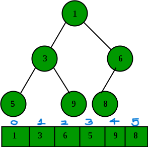

# Heap

- A heap is a specialized tree-based data structure that satisfies the heap property.

- Heaps are Allmost complete binary trees, meaning all levels of the tree are fully filled except possibly for the last level, which is filled from left to right.

- There are two types of heaps:

  - <b>Max-Heap</b>: In a max-heap, for any given node i, the value of i is greater than or equal to the values of its children.The largest element is at the root of the heap.
  - <b>Min-Heap</b>: In a min-heap, for any given node i, the value of i is less than or equal to the values of its children. The smallest element is at the root of the heap.

<b>NOTE:</b> Always take heap has max heap unless specified.

# Representation of Heap

- Unless stated otherwise, a heap is usually represented as an linear array in memory.

- The root element will be at Arr[0].

  

# How to find the index of , parent and children of a node?

- The parent of the node at index i is given by the formula (i-1)/2.

- The left child of the node at index i is given by the formula 2\*i + 1.

- The right child of the node at index i is given by the formula 2\*i + 2.

<b>Note : </b> Try to apply these formulas on above given diagram to understand better.
