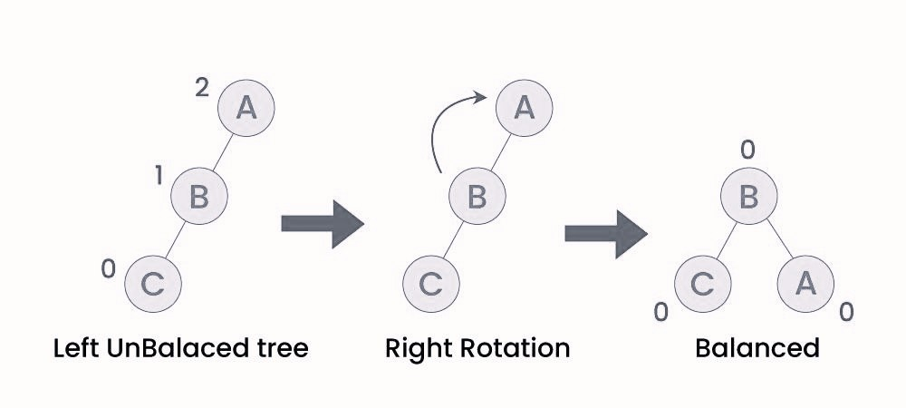
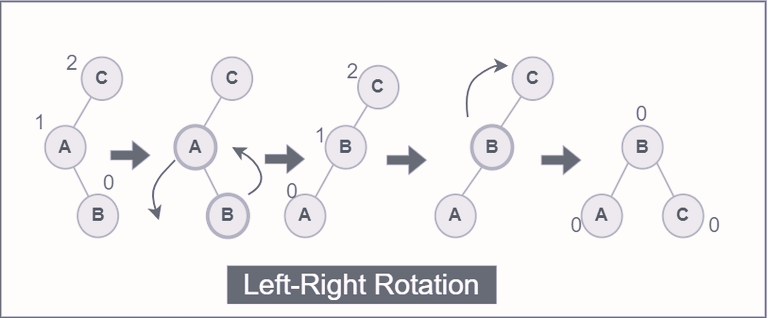
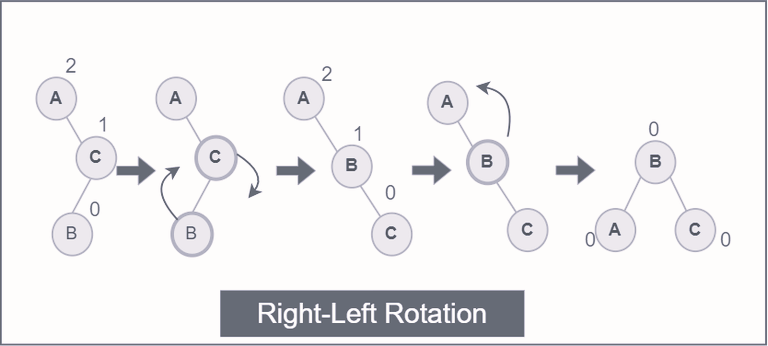

# AVL Tree Data Structure (Adelson-Velskii and Landis Tree)

- AVL tree is self balancing Binry Search Tree in which each node has a balance factor whose value is either -1, 0 or +1.

- The difference between the heights of the left subtree and the right subtree for any node is known as the balance factor of the node.
  

#### Why Do We Need an AVL Tree?

- As we learned about skewed Binary tree which is either dominated by left nodes or right nodes,these perticular types of BST, makes the operation on BST to take O(n) time, where n is the number of nodes in the tree i.e. insertion, deletion, searching.So here comes the AVL tree :
  - AVL trees maintain a balance factor for each node, which is the difference in height between the left and right subtrees. This balance factor is kept at -1, 0, or +1.
  - After every insertion or deletion, AVL trees perform rotations to ensure that the tree remains balanced.
  - This self-balancing ensures that the height of the tree remains O(log n), where n is the number of nodes.
  - Because AVL trees are balanced, the operations of search, insert, and delete all have a guaranteed time complexity of O(log n),having n nodes.

## Rotation

#### Rotating the subtrees in an AVL Tree:

- An AVL tree may rotate in one of the following four ways to keep itself balanced:

1. <b>Left Rotation</b>: When a node is added into the right subtree of the right subtree, if the tree gets out of balance, we do a single left rotation.

   

2. <b>Right Rotation</b>: If a node is added to the left subtree of the left subtree, the AVL tree may get out of balance, we do a single right rotation.

   

3. <b>Left-Right Rotation</b>: A left-right rotation is a combination in which first left rotation takes place after that right rotation executes.

   

4. <b>Right-Left Rotation</b>:A right-left rotation is a combination in which first right rotation takes place after that left rotation executes.

   

#### Aplications of AVL tree

- It is applied in corporate areas and storyline games.
- It is used to index huge records in a database and also to efficiently search in that.
- For all types of in-memory collections, including sets and dictionaries, AVL Trees are used.
