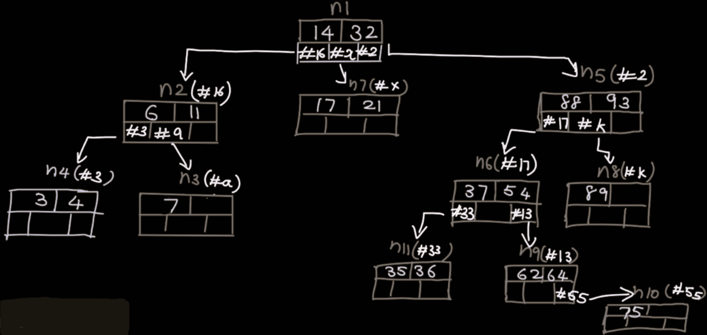

# M-way Trees

- An M-way(multi-way) tree is a tree that has the following properties:
  - Each node in the tree can have at most m children.
  - Nodes in the tree have at most (m-1) key fields and pointers(references) to the children.
- <b>NOTE:</b> `https://youtu.be/QgD4_nIwV8w?si=FE-WrdHU2N3693on` watch at 1.5x.

# M-way Search Trees

- An M-way search tree is a more constrained m-way tree, and the constraints on an M-way tree that makes it an M-way search tree are:

  - Each node in the tree can have at most m children.

  - Nodes in the tree have at most (m-1) key fields and pointers(references) to the children.

  - The keys in any node of the tree are arranged in a sorted order(ascending).

  - For each key in a node, all the keys in the child subtree directly to its left are smaller than this key.

    - Example : If a node has keys [15, 30]:

      - The first child subtree has keys less than 15.
      - The second child subtree has keys between 15 and 30.
      -                         [15, 30]
                               /    |    \
                          [0-14] [16-29] [31+]
      - [0-14]:Keys less than 15, are in left subtree of 15.
      - [16-29]: Keys between 15 and 30

  - For each key in a node, all the keys in the child subtree directly to its right are greater than this key.

    - Example : In the above example keys in directly right child subtree of 30 are [31+].

- <b>Steps while Insertion :</b>

  1. Always start to search the place to insert from the root.

  2. Insert keys in node till key count == m-1.

  3. If Node full and key k_new < key_parent,insert it to left sub tree node.

  4. If Node full and key k_new > key_parent,insert it to right sub tree node.

  5. Repeat process untill all keys are inserted.

- <b>Cases while Deletion</b>

  1. If key to be deleted has no subtree,simply delete it.

  2. If key to be deleted has left subtree, replace it with the largest value from left subtree.Now delete largest value from left subtree.

  3. If key to be deleted has right subtree,replace it with the smallest value from right subtree.Now delete smallest value from right subtree.

  4. If key to be deleted has left and right subtree,replace it with smallest value from RST or largest value from LST.Now delete the replaced value.

- <b>Example :</b> keys ->14, 32, 11, 6, 7, 4, 3, 88, 93, 54, 37, 21, 17, 89, 62, 64, 75, 35, 36.

  

# B Trees

<b>NOTE:: </b>Ceiling Function : The ceiling function, often denoted as ⌈x⌉, is a mathematical function that maps a real number to the smallest integer greater than or equal to that number.

- Example 1 : ⌈2.3⌉=3, Here,3 is the smallest integer, greater than or equal to 2.3 .
- Example 2 : ⌈−1.2⌉=−1.Here, -1 is the smallest integer,greater than or equal to -1.2.

<b>NOTE:: </b>Internal nodes: An internal node is a node in a tree that has one or more children i.e. any node that is not an endpoint of the tree.

- <b>Now KEY points of B tree :</b>

  1. For each node x, the keys are stored in increasing order.

  2. Each node ha at most 'm' children.

  3. Each Internal node has at least ceiling of m/2 children.

  4. Root node has atleast two children if it is not leaf.

  5. All leaf node appear in the same level.

  6. A non leaf node with 'K' children has 'k-1' keys.

- <b>Insertion</b>

  - Example :
    

  - Key points:
    

  - <b>Note:</b> Node with Even Number of Keys:

    - Let the node temporarily contain 2m keys: [k1, k2, ..., km, km+1, ..., k2m].

    - When splitting, the middle key to move up, is the (m+1)th key (considering one-based indexing). For zero-based indexing, it is the (m)th key. <b>Choice is yours,but follow only one in each insertion.</b>

- <b>Deletion</b>

  - I will suggest you to watch the video for better understanding.Because it is a bit complex to write here.

  - Link : `https://youtu.be/0NvlyJDfk1M?si=FLluiH6oP258sY2m` watch at >= 1.25x.

# Difference between B Tree and B+ Tree:

| B Trees                                                 | B+ Trees                                                       |
| ------------------------------------------------------- | -------------------------------------------------------------- |
| Data is stored in leaf nodes as well as internal nodes. | Data is stored in only leaf nodes.                             |
| Searching is slower and deletion is complex.            | Searching is faster,deletion is easy(directly from leaf node). |
| No redundant search key.                                | Redundant key may present.                                     |
| Leaf nodes are not linked together.                     | Leaf nodes are linked together.                                |
