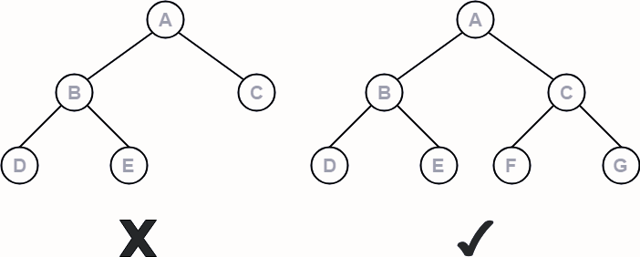

# Tree data structure

- Tree data structure is a hierarchical structure that is used to represent and organize data in a way that is easy to navigate and search.

- The topmost node of the tree is called the root, and the nodes below it are called the child nodes. Each node can have multiple child nodes, and these child nodes can also have their own child nodes, forming a recursive structure.

# Basic Terminologies In Tree Data Structure:

- <u>Parent Node</u>: The node which is a predecessor of a node is called the parent node of that node. Ex: {B} is the parent node of {D, E}.

- <u>Child Node</u>: The node which is the immediate successor of a node is called the child node of that node. Examples: {D, E} are the child nodes of {B}.

- <u>Root Node</u>: The topmost node of a tree or the node which does not have any parent node is called the root node. {A} is the root node of the tree. A non-empty tree must contain exactly one root node and exactly one path from the root to all other nodes of the tree.

- <u>Degree of Node</u>: Degree of a node implies the number of child nodes a node has.

- <u>Leaf Node or External Node</u>: The nodes which do not have any child nodes are called leaf nodes. {I, J, K, F, G, H} are the leaf nodes of the tree.

- <u>Ancestor of a Node</u>: Any predecessor nodes on the path of the root to that node are called Ancestors of that node. {A,B} are the ancestor nodes of the node {E}

- <u>Descendant</u>: A node x is a descendant of another node y if and only if y is an ancestor of x.

- <u>Sibling</u>: Children of the same parent node are called siblings. {D,E} are called siblings.

- <u>Level of a node</u>: Level of a node represents the generation of a node. If the root node is at level 0, then its next child node is at level 1, its grandchild is at level 2, and so on.

- <u>Internal node</u>: A node with at least one child is called Internal Node.

- <u>Subtree</u>: Descendants of a node represent subtree. Tree being a recursive data structure can contain many subtrees inside of it. Example: D,I and J represent one subtree.

- <u>Edge</u>: A link connecting one node to another is called an edge.

- <u>Height of Node</u>: Height of a node represents the number of edges on the longest path between that node and a leaf.

- <u>Path</u>: Path is a number of successive edges from source node to destination node.

- <u>Branch</u>: Branch is a path which ends at leaf node.

# Types of Trees in Data Structure based on the number of children:

1. <u>Binary Tree</u>

- A binary Tree is defined as a Tree data structure with at most 2 children. Since each element in a binary tree can have only 2 children, we typically name them the left and right child.

2. <u>Ternary Tree</u>

- A Ternary Tree is a tree data structure in which each node has at most three child nodes, usually distinguished as “left”, “mid” and “right”.

3. <u>N-ary Tree (Generic Tree)</u>

- Generic trees are a collection of nodes where each node is a data structure that consists of records and a list of references to its children(duplicate references are not allowed). Unlike the linked list, each node stores the address of multiple nodes.

  

# Types Of Binary Trees

1. <u>Full/ Strict Binary Tree</u>

- A Binary Tree in which each node having either 0 or 2 children.

  

2. <u>Almost Complete Binary Tree-</u>

- An almost complete binary tree is a binary tree that satisfies the following 2 properties-

  - All the levels are completely filled except possibly the last level.
  - The last level must be strictly filled from left to right.

  

3. <u>Complete/ perfect Binary Tree</u>

- A complete binary tree is a binary tree that satisfies the following 2 properties-

  - Every internal node has exactly 2 children.
  - All the leaf nodes are at the same level.

  

4. <u>Skewed Binary Tree</u>

- A binary tree which is either dominated by left nodes or right nodes.
  
