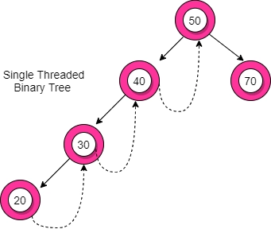
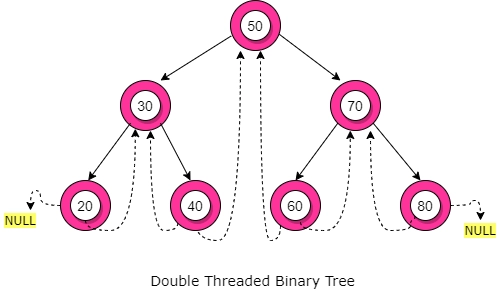

# Threaded Binary Tree

- Inorder traversal of a Binary tree can either be done using recursion or with the use of a auxiliary stack.

- The idea of threaded binary trees is to make inorder traversal faster and do it without stack and without recursion.

- In a Threaded Binary Tree, the nodes will store the in-order predecessor or successor instead of storing NULL in the left/right child pointers.

- So the basic idea of a threaded binary tree is that for the nodes whose right pointer is null, we store the in-order successor of the node (if-exists), and for the nodes whose left pointer is null, we store the in-order predecessor of the node(if-exists).

- One thing to note is that the leftmost and the rightmost child pointer of a tree always points to null as their in-order predecessor and successor do not exist.

## Types Of Threaded Binary Tree

1. Single Threaded or One way Threaded:

- In this the NULL right pointer is made to point to the inorder successor (if successor exists).

  

- Structure :

```c struct Node{
  int value;
  Node* left;
  Node* right;
  bool rightThread;
  }
```

2. Double Threaded or Two-way Threaded :

- In this type, the left null pointer of a node is made to point towards the in-order predecessor node and the right null pointer is made to point towards the in-order successor node.

  

- Structure :

```c
  struct Node{
  int value;
  Node* left;
  Node* right;
  bool rightThread;
  bool leftThread;
  }
```

## Advantages :

#### 1. <u>No need for stacks or recursion</u> : Unlike binary trees, threaded binary trees do not require a stack or recursion for their traversal.

#### 2. <u>Optimal memory usage</u> : Another advantage of threaded binary tree data structure is that it decreases memory wastage. In normal binary trees, whenever a node’s left/right pointer is NULL, memory is wasted. But with threaded binary trees, we are overcoming this problem by storing its inorder predecessor/successor.

## Disadvantages :

#### 1. <u>Complicated insertion and deletion</u> : By storing the inorder predecessor/ successor for the node with a null left/right pointer, we make the insertion and deletion of a node more time-consuming and a highly complex process.

#### 2. <u>Extra memory usage</u> : Every node in threaded binary tree need extra information(extra memory) to indicate whether its left or right node indicated its child nodes or its inorder predecessor or successor. So, the node consumes extra memory to implement.
